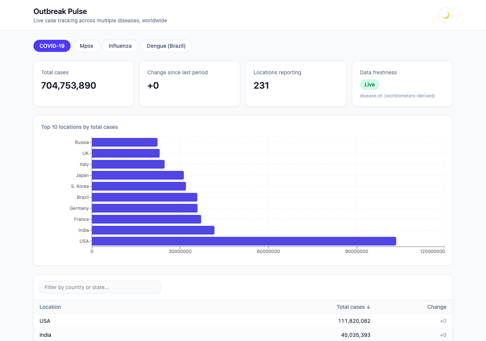
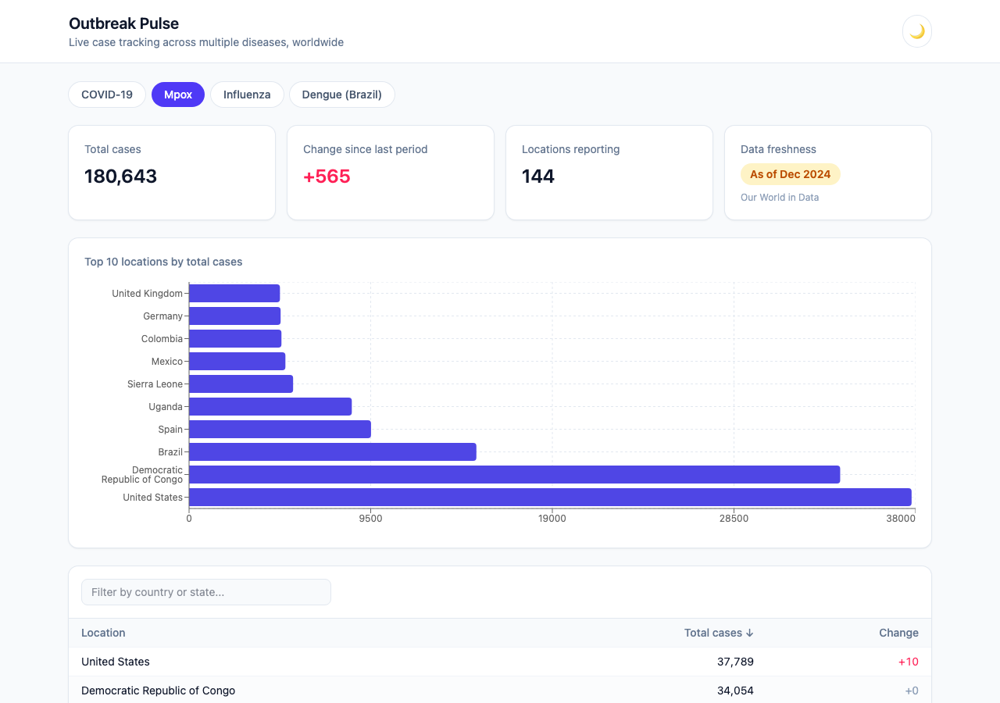
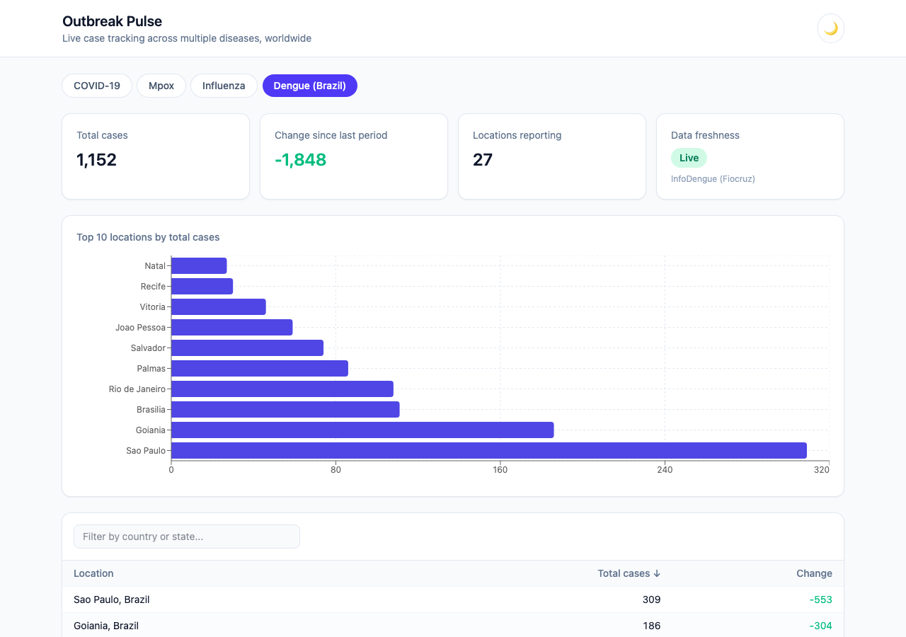
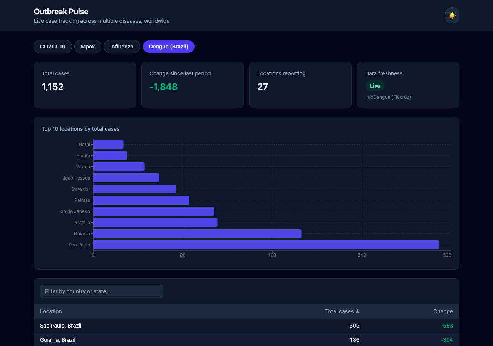

# Disease Outbreak Pulse

Live, multi-disease outbreak tracker. Started as a COVID-19-only tracker; now
pulls from real public health data sources to show case counts and trends
across several diseases at once.

## Screenshots

| COVID-19 | Mpox (stale-data badge) |
|---|---|
|  |  |

| Dengue (light) | Dengue (dark) |
|---|---|
|  |  |

## Diseases tracked

| Disease | Coverage | Source | Freshness |
|---|---|---|---|
| COVID-19 | Global, per-country | [disease.sh](https://disease.sh) | Live |
| Mpox | Global, per-country | [Our World in Data](https://github.com/owid/monkeypox) | As of Dec 2024 (source dataset stopped updating) |
| Influenza | Global, per-country/week | [WHO FluNet](https://www.who.int/tools/flunet) | Live |
| Dengue | Brazil, per state capital | [InfoDengue (Fiocruz)](https://info.dengue.mat.br) | Live |

There is no free, actively-maintained global API for every disease. Mpox and
Dengue are the best real data available (a frozen-but-real dataset, and a
country-scoped-but-live one, respectively) rather than fabricated feeds — the
UI's "Live" / "As of <date>" badge always reflects which kind you're looking
at.

## Architecture

- **Backend**: Spring Boot 3 / Java 21 REST API (`src/main/java`). A
  `DiseaseDataProvider` per disease fetches and normalizes its source into a
  common shape; `DiseaseDataService` caches the results and refreshes them on
  a schedule. See `/api/diseases`, `/api/diseases/{code}/summary`, and
  `/api/diseases/{code}/stats`.
- **Frontend**: React + TypeScript + Vite + Tailwind CSS (`frontend/`). A
  disease switcher, summary cards, a top-locations chart, and a sortable
  table, with light/dark mode.

In production, the frontend is built as static assets served directly by
Spring Boot, so the app ships as a single runnable jar.

## Running locally

### Backend

```bash
./mvnw spring-boot:run
```

Serves the API at `http://localhost:8080/tracker`.

### Frontend (dev mode, hot reload)

```bash
cd frontend
npm install
npm run dev
```

Open `http://localhost:5173/tracker/`. The dev server proxies `/tracker/api`
to the backend on port 8080, so run the backend first.

### Full production build

```bash
cd frontend && npm run build   # outputs into src/main/resources/static
cd .. && ./mvnw package
java -jar target/coronavirus-tracker-0.0.1-SNAPSHOT.jar
```

Open `http://localhost:8080/tracker/`.
